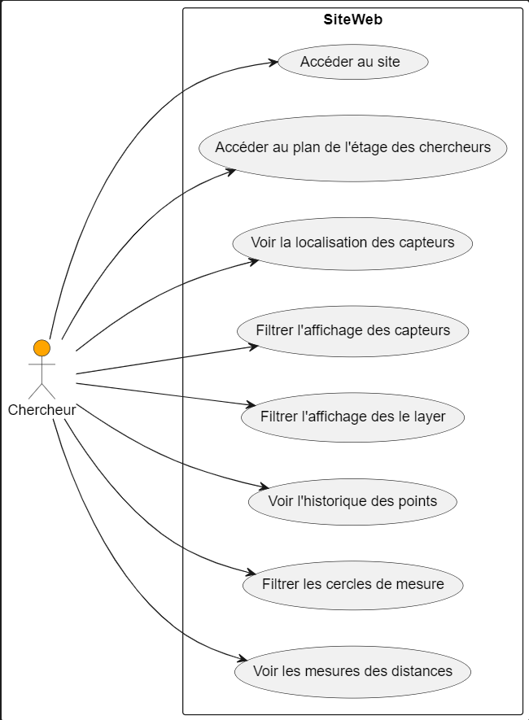
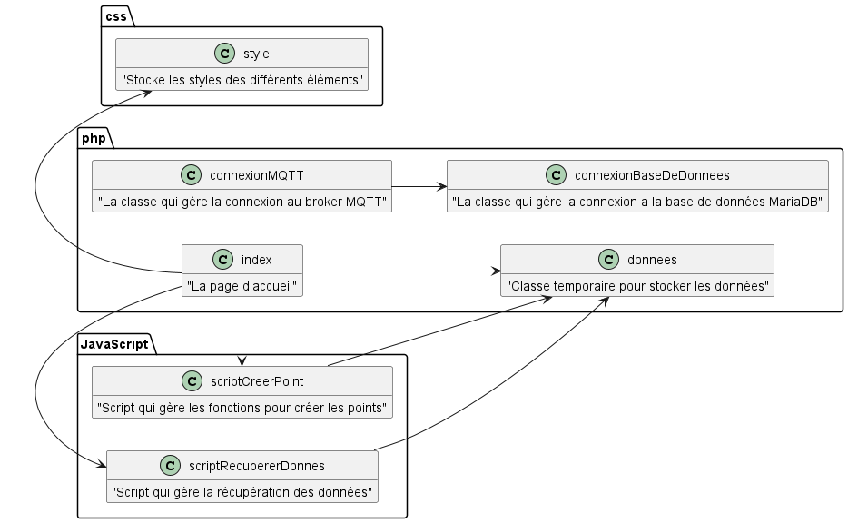

:toc: macro

= Documentation Technique SAE-ALT-S3-Dev-23-24-LocURa

=== Sommaire
toc::[]

== Equipe 2023-2024

Groupe 4 :

- CHAROUKI Aymen	
- FONTANILLES Alexi
- PAGNUCCO Nathan
- PICUIRA Tanguy

== Présentation du projet

===  *Contexte Générale*

La plateforme de recherche LocURa4IoT, hébergée à l’IUT de Blagnac, utilise actuellement un outil de visualisation des positions de tags mobiles dans l’environnement du laboratoire. Cette visualisation est essentielle à des fins de compréhension des résultats de recherche ainsi que pour des démonstrations pédagogiques. Concrètement, l'outil représente les différents éléments du système de localisation, tels que les ancres/références, les tags/mobiles, les murs, etc., sur une carte interactive.

=== Objectif du Projet 
L'objectif principal de ce projet est d'améliorer l'interface actuelle en ajoutant des fonctionnalités cruciales pour une expérience utilisateur plus avancée. Ces fonctionnalités comprennent la possibilité d'activer/désactiver certains éléments à afficher, la sélection d'éléments avec des options de filtrage, et l'affichage de la trace des mobiles, incluant les mouvements et l'historique des positions.

=== Technologies Utilisées 
Les technologies au cœur de ce projet sont le web, JavaScript (JS), Scalable Vector Graphics (SVG), MQTT (Message Queuing Telemetry Transport), et les WebSockets. Ces technologies offrent une base solide pour la création d'une interface interactive et en temps réel.

==  Cas d'Utilisation Global

Cette application, conçue exclusivement pour les chercheurs du laboratoire, propose les cas d'utilisation suivants :

* Consulter les Mesures de Distance
** Consulter les mesures de distance sur le site web pour visualiser les distances entre les points dans le laboratoire.

* Accéder à l'Historique des Points
** Accéder à la base de données pour consulter l'historique de chaque point. Analyser les données passées pour obtenir un aperçu temporel.

* Visualiser les Mesures de Distance
** Visualiser les mesures de distance sur le site web pour une représentation graphique claire des distances entre les points dans le laboratoire.

* Explorer la Localisation des Capteurs
** Accéder au plan et à la localisation des capteurs sur le site web pour améliorer la visualisation des expériences.

* Filtrer les Layers pour Localiser les Objets Connectés
** Filtrer l'affichage des layers sur le site web pour localiser les étages des objets connectés dans le laboratoire.

* Filtrer l'Affichage des IDs Objets
** Filtrer l'affichage des IDs objets sur le site web pour identifier des informations spécifiques dans le laboratoire.

* Consulter le Contenu du Site Web
** Accéder au site web pour consulter son contenu, y compris les informations, résultats de recherche et démonstrations.

== Diagrammes des cas d'utilisation
Celui-ci présente le diagramme des cas d'utilisation de notre projet :

Comme vous pouvez voir sur le diagramme des cas d'utilisation, nous avons 7 cas d'utilisation différents : 

- Consulter le Contenu du Site Web.
- Accéder au plan de l'étage des chercheurs 
- Accéder à l'Historique des Points
- Visualiser les Mesures de Distance
- Explorer la Localisation des Capteurs
- Filtrer l'affichages de Layers pour les futurs différents étages
- Filtrer l'Affichage des capteurs 
 

Ces cas d'utilisation sont tous liés à la classe *index* qui représente la page d'acceuil.

== Diagrammes des classes 
Celui-ci présente le diagramme des classes de notre projet :

Comme vous pouvez voir sur le diagramme des classes, nous utilisons 3 langage de programmation différents : PHP, JavaScript et CSS. La classe *index* représente la page d'acceuil et accède à la classe *style* où il y a les styles CSS. La classe *index* accède aussi à la classe *scriptRecupererDonnes* qui permet de récupérer les données des capteurs. La classe *scriptRecupererDonnes* accède à la classe *donnes* qui stocke temporairement des donnés au format JSON. La classe *index* accède aussi à la classe *scriptCreerPoint* qui permet de créer les points sur la page web. La classe *scriptCreerPoint* accède à la classe *donnees* qui permet de stocker temporairement les données. La classe *index* accède aussi à la classe *connexionMQTT* qui permet de se connecter au broker MQTT. Et enfin la classe *connexionMQTT* accède à la classe *connexionBaseDeDonnees* qui permet de se connecter à la base de données pour pouvoir stocké les donnés récupérés dans la base de données.

== Fonctionnalités

=== Utilisation de Docker
Cette application est conçue pour fonctionner dans un environnement Dockerisé, garantissant une gestion efficace des dépendances et une portabilité accrue entre différentes configurations. Docker simplifie le déploiement de l'application en encapsulant tous les composants nécessaires dans des conteneurs isolés, assurant ainsi une cohérence et une facilité de gestion pour les chercheurs du laboratoire.

=== Présentation des Fichiers Clés
* docker-compose.yml
** Le fichier docker-compose.yml configure les services et les dépendances nécessaires à l'exécution de l'application dans un environnement Docker. Il définit les conteneurs, les réseaux, et d'autres paramètres essentiels.

* connexionMQTT.php
** Le fichier connexionMQTT.php gère la connexion à un broker MQTT, permettant la communication entre les capteurs et l'application. Il établit les paramètres de connexion et détaille les topics MQTT utilisés.

* connexionBaseDeDonnees.php
** Le fichier database.php gère l'interaction avec la base de données MariaDB. Il comprend la configuration des paramètres de base de données ainsi que les requêtes SQL nécessaires pour interagir avec la base de données.

* index.php
** Le fichier index.php représente la page d'accueil de l'application. Il est lié à tous les autres fichiers pour récupérer et afficher les données. La structure de la page est 
détaillée, mettant en évidence les éléments clés.

* donnees.php
** Le fichier donnees.php contient une classe utilisée pour le stockage temporaire de données. 

* scriptRecupererDonnes.js
** Le script scriptRecupererDonnes.js est responsable de la récupération des données côté client. Il assure la communication avec le backend.

* scriptCreerPoint.js
** Le script scriptCreerPoint.js est chargé de créer des points graphiques sur la page web, offrant une représentation visuelle des données récupérées. Il peut utiliser des bibliothèques ou frameworks pour la visualisation.

* styles.css
** Le fichier styles.css contient les styles CSS utilisés pour la mise en page et la présentation graphique des éléments sur la page web.

Ces fichiers essentiels, associés à la configuration Docker, forment la base de l'application, permettant aux chercheurs d'interagir efficacement avec les données de localisation dans le laboratoire.
